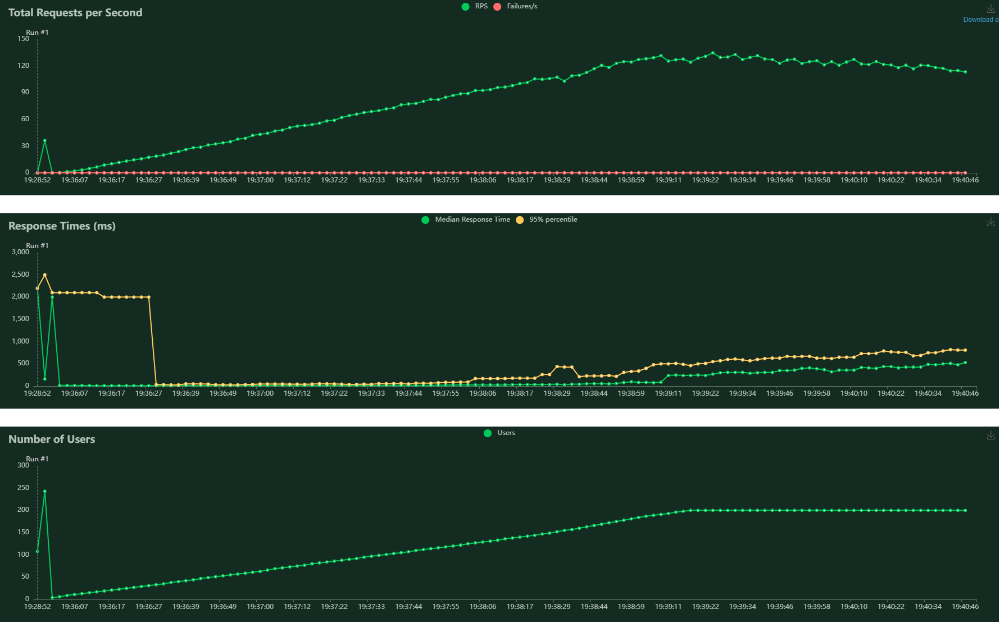
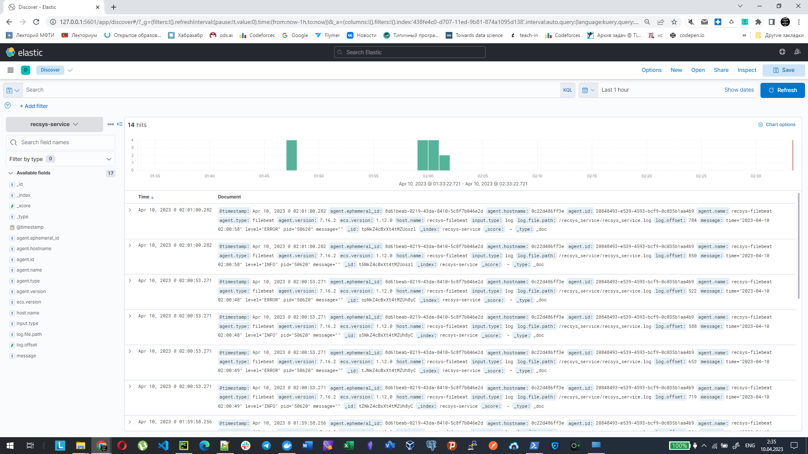
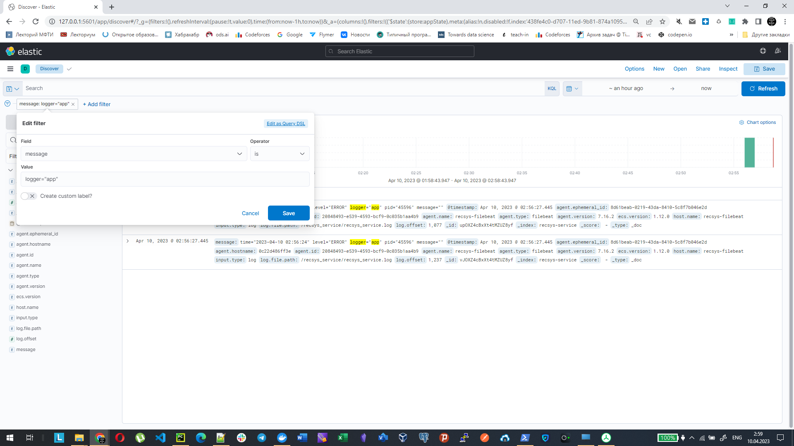
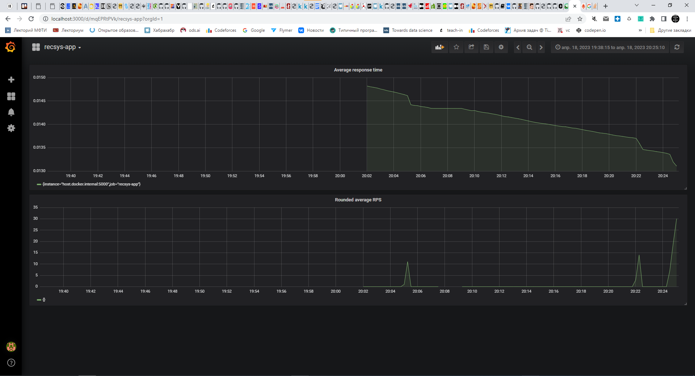
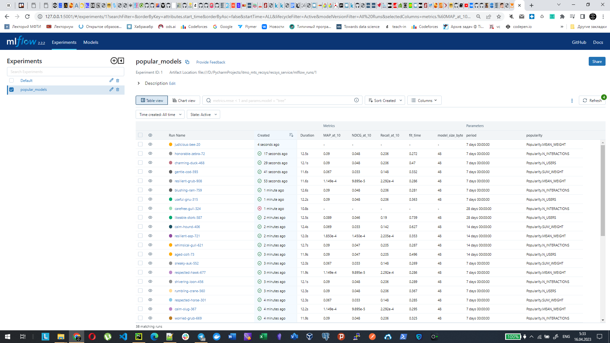

# Сервис рекомендаций

[](https://github.com/pacifikus/recsys_service/actions/workflows/tests.yml)
[](https://github.com/pacifikus/recsys_service/actions/workflows/code-style.yml)

## Описание

[FastAPI](https://fastapi.tiangolo.com/) сервис для получения рекомендаций из 10 объектов для каждого пользователя из тестовой выборки МТС Kion.

### Данные

Для реализации были использованы данные из приложения МТС Kion по взаимодействиям пользователей с контентом за период 6 месяцев, взятые из [RecSys Course Competition](https://ods.ai/competitions/competition-recsys-21).
Датасет содержит:

- факты просмотра контента пользователями
- описание контента
- описание пользователей

## Запуск приложения

### Инициализация окружения

Выполните команду
```
make setup
```

Будет создано новое виртуальное окружение в папке `.venv`.
В него будут установлены пакеты, перечисленные в файле `pyproject.toml`.

### Установка пакетов

Для установки новых пакетов используйте команду `poetry add`.

### Запуск сервиса

#### Способ 1: Python + Uvicorn

```
python main.py
```

Приложение запустится локально, в одном процессе. 
Хост и порт по умолчанию: `127.0.0.1` и `8080`.
Их можно изменить через переменные окружения `HOST` и `PORT`.

Управляет процессом легковесный [ASGI](https://asgi.readthedocs.io/en/latest/) server [uvicorn](https://www.uvicorn.org/).


#### Способ 2: Uvicorn

```
uvicorn main:app
```

Запуск напрямую через [uvicorn](https://www.uvicorn.org/).

#### Способ 3: Docker

Собрать и запустить Docker-образ можно командой

```
make run
```

## Запуск тестов

### Нагрузочное тестирование

Нагрузочное тестирование реализовано с помощью инструемента [Locust](https://locust.io/) в `tests/locustfile.py`.
Для запуска необходимо:
- установить locust командой `pip install locust`
- перейти в папку `tests`
- запустить  locust web UI в терминале командой `locust`
- открыть `http://localhost:8089/` и указать параметры теста (Number of users, Spawn rate, Host with running search server)
- запустить тест

Текущие результаты тестирования для модели LightFM:
- Locust Setup
  - Number of users (peak concurrency): 200
  - Spawn rate (users added/stopped per second): 1
- Results
  - Max RPS: 113.4
  - Max Median response time: 480





## Мониторинг

### ELK 

Для запуска сбора логов в ELK необходимо:
- запустить сервис
- запустить Elasticsearch + Kibana + filebeat командой `docker-compose up`
- зайти в консоль ELK и отфильтровать нужные логи







### Prometheus + Grafana 

Для запуска сбора метрик в Prometheus и отрисовки дашбордов необходимо:
- запустить сервис
- запустить Prometheus + Grafana командой `docker-compose -f docker-compose-prometheus.yml up`
- зайти в http://localhost:3000 и настроить вид дашбордов




### Трекинг экспериментов с MLflow

Для запуска MLflow сервера необходимо выполнить команду:

```mlflow server --backend-store-uri=sqlite:///mlflow_recsys.db --default-artifact-root=file:mlflow_runs --host 0.0.0.0 --port 5001```

Графический интерфейс MLflow можно запустить через `mlflow ui` 

Лог эксперимента `popular_models`:


